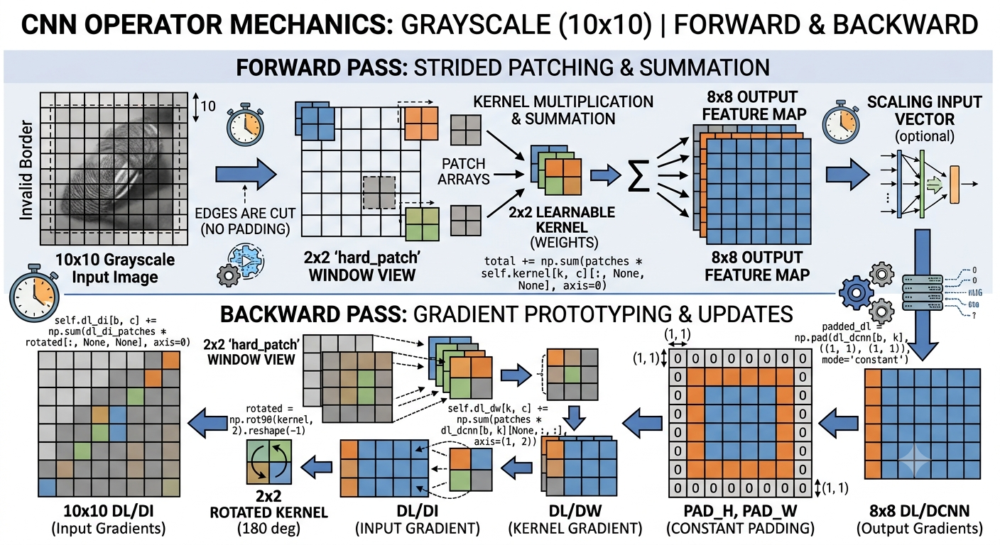

# CNN_MicroKernel---CPU-Optimized-NumPy-Engine-for-Accelerated-Neural-Operators
CNN_MicroKernel - is a minimal, dependency-free deep learning library built entirely on NumPy. It implements fundamental convolutional layers, forward passes, and backpropagation mechanics optimized strictly for CPU execution.

* **Zero External Dependencies:** Built strictly using pure Python and NumPy.
* **Explicit Mechanics:** Standard 2D convolutions, spatial patching, and gradient updates without abstract C++ extensions.
* **CPU-Native Execution:** Designed for lightweight research environments, embedded systems, and algorithmic prototyping.

# Time Comparison 

* ** CNN_Microkernel
          
          CNN_MicroKernel
          --------------------------------
          Device      : CPU
          Input shape : (1, 1, 442, 354)
          Kernel      : (3, 3)
          N kernels   : 10
          Runs        : 50
          Average     : 0.13139847712012853 seconds
          Minimum     : 0.11924026500128093 seconds
  
* ** CNN Nested loop verion ( 5 itteration )
  

* ** Torch CPU environment

* ** Torch Cuda environment
  
                    PyTorch CUDA
                    --------------------------------
                    Input shape : (1, 1, 442, 354)
                    Kernel      : (3, 3)
                    N kernels   : 10
                    Runs        : 50
                    Average     : 0.0006365723600038109 seconds
                    Minimum     : 0.0006103940000343755 seconds
  

# Story Backend + Technical stuff

Main reason i decided to make it in most case probibly 90 - 95 % we use 2x2 and 3x3 kernels no doubt exeptions AlexNet, ResNet stem  ,ConvNeXt 
so i decided to hard coded this 

                        if self.kernel_size[0] == 2:
                          self.hard_patch = lambda input : np.array([input[:-1,:-1],input[:-1 , 1:] ,input[1:,:-1],input[1:,1:]])
                          
                        elif self.kernel_size[0] == 3:
                          self.hard_patch = lambda input : np.array([input[:-2, :-2] , input[:-2, 1:-1] , input[:-2, 2:]  ,
                                                      input[1:-1, :-2] ,input[1:-1, 1:-1] , input[1:-1, 2:] ,
                                                      input[2:, :-2] ,input[2:, 1:-1] ,input[2:, 2:]])
I know it does not look comthing fancy but i noticed that instead running trough patch by patch and multiply it to kernel inmatrix form  we can scale input vector to 
kernel elements but one this is hold we have to cut a few parts based on kernel shape 

                                                      
